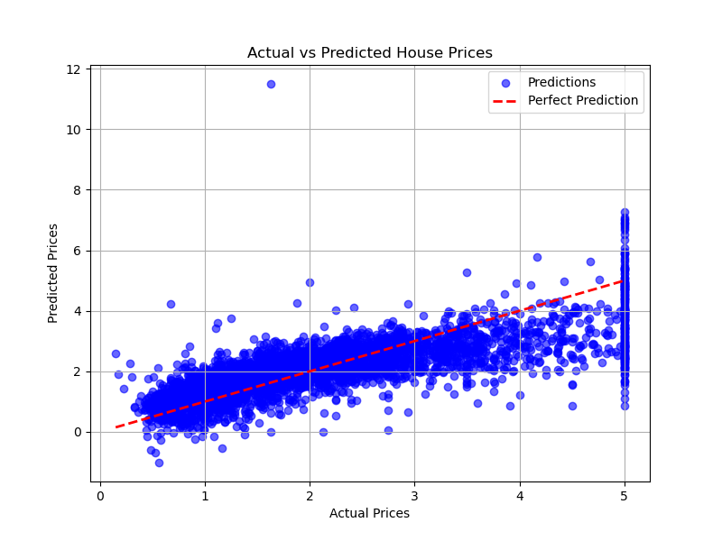

# House Price Prediction using Machine Learning



## Project Overview

This project predicts house prices using the **California Housing Dataset** and a **Linear Regression** model.

You will learn how to:

- Load and explore a real-world dataset
- Prepare data for machine learning
- Train and evaluate a regression model
- Visualize results with plots

---

## Dataset

The project uses the **California Housing Dataset**, which contains features like average rooms, location coordinates, and median income to predict house prices.

---

## How It Works

1. Load the dataset and convert it to a DataFrame  
2. Split data into training and testing sets  
3. Train a Linear Regression model on the training data  
4. Predict house prices on the test set  
5. Evaluate the model using Mean Squared Error (MSE)  
6. Visualize actual vs predicted prices with a scatter plot  

---

## Installation

To run this project, you need Python 3 and the following libraries:

- numpy  
- pandas  
- scikit-learn  
- matplotlib  

You can install dependencies using:

```bash
pip install -r requirements.txt

```

## Usage

Clone the repository:

```bash
git clone https://github.com/musfique-anam/house-price-prediction-ml.git

```
Navigate to the project folder:

```bash
cd house-price-prediction-ml

```
Open the Jupyter Notebook house_price_prediction_ml.ipynb and run all cells.

## File Structure

```bash
house-price-prediction-ml/
│
├── images/                         # Folder containing saved plots
│ └── actual_vs_predicted.png       # Plot image of predictions
└── README.md                       # Project documentation
├── house_price_prediction_ml.ipynb # Jupyter notebook with full code
├── requirements.txt                # Python dependencies

```